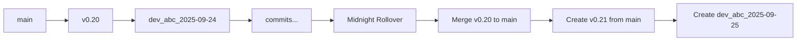

# 🚀 CS_DevOpsAgent - DevOps Automation

[](https://nodejs.org/)
[](LICENSE)
[](README.md)
[](https://github.com/SecondBrainAICo/CS_DevOpsAgent)
[](Update%20Notes/2025-01-28-multi-agent-coordination.md)
[](test_cases/)

**Built by [Sachin Dev Duggal](https://github.com/sachindduggal) | [SecondBrain AI](https://github.com/SecondBrainAICo)**

A sophisticated multi-agent Git automation system that enables multiple AI coding assistants to work simultaneously on the same codebase without conflicts. Features automatic worktree management, infrastructure change tracking, intelligent commit detection, and comprehensive testing infrastructure.

Born a little out of frustration that I couldn't get multiple agents to work on the same codebase so this was more for our own development - hopefully it helps you. 

## 📝 Table of Contents

- [Features](#✨-features)
- [Quick Start](#🚀-quick-start)
- [Installation](#📦-installation)
- [Usage](#📖-usage)
- [Multi-Agent Coordination](#🤝-multi-agent-coordination-new-v210)
- [Configuration](#⚙️-configuration)
- [Branching Strategy](#🌳-branching-strategy)
- [VS Code Integration](#💻-vs-code-integration)
- [Troubleshooting](#🐛-troubleshooting)
- [API Reference](#📚-api-reference)
- [Contributing](#🤝-contributing)
- [License](#📄-license)

## ✨ Features

### 🤖 Multi-Agent Worktree Management (NEW)
- **🔍 Automatic Agent Detection** - Identifies AI agents from environment (Claude, Copilot, Cursor, Aider, Warp)
- **🏗️ Isolated Workspaces** - Each agent gets its own Git worktree with dedicated branch
- **⚡ Zero Conflicts** - Agents work in parallel without stepping on each other
- **🌲 Smart Branch Naming** - `agent/{name}/{task}` convention for clarity
- **📁 Infrastructure Tracking** - Documents changes in `/Documentation/infrastructure.md`

### 🤝 Multi-Agent Coordination System (v2.1.0 - NEW)
- **📋 Prep TODO Handshake** - Agents request permission before editing files
- **🎯 Shard-Based Reservations** - Path-based conflict prevention with 12 logical shards
- **⚖️ Priority Queue System** - 10-level priority for task scheduling (1-10)
- **🚦 Real-Time Monitoring** - Track agent status with `monitor-agents.sh`
- **🔔 Conflict Alerts** - Automatic notifications in `.git/.ac/alerts/`
- **🎨 Three Strategies** - Block, branch, or queue overlapping work

### Core Functionality
- **🔄 Automatic Commits** - Watches for file changes and commits automatically
- **📝 Commit Message Validation** - Enforces conventional commit format
- **🌳 Smart Branching** - Daily branches with automatic rollover at midnight
- **📊 Version Management** - Micro-revision versioning (v0.20, v0.21, etc.)
- **🚀 Auto Push** - Optionally pushes commits to remote repository
- **📜 Change Tracking** - Maintains changelog of all automated commits

### Developer Experience
- **🎨 Interactive Setup** - Wizard-based configuration for new developers
- **🔧 VS Code Integration** - Tasks and settings for seamless workflow
- **🐛 Debug Mode** - Comprehensive logging for troubleshooting
- **⚡ Debounced Operations** - Prevents commit spam with smart delays
- **🔐 Safe Operations** - Non-destructive merges and conflict handling

### Advanced Features
- **🌍 Timezone Support** - Configurable timezone for daily branches
- **🔄 Daily Rollover** - Automatic branch management at day boundaries
- **📌 Version Tags** - Creates git tags for version milestones
- **🗄️ Archive Management** - Automatic archival of old branches
- **💾 State Recovery** - Resumes from last known state on restart
- **🧪 Targeted Testing** - Only runs tests for changed areas
- **📊 Infrastructure Documentation** - Auto-generates infrastructure change logs

## 🌐 Installation from GitHub

### Clone the Repository

```bash
# Clone the repository
git clone https://github.com/SecondBrainAICo/CS_DevOpsAgent.git CS_DevOpsAgent

# Navigate to the directory
cd CS_DevOpsAgent

# Run the quick setup
./quick-start.sh
```

### Or Add as a Submodule

```bash
# Add as a git submodule to your project
git submodule add https://github.com/SecondBrainAICo/CS_DevOpsAgent.git CS_DevOpsAgent

# Initialize and update the submodule
git submodule init
git submodule update

# Run setup
cd CS_DevOpsAgent && ./quick-start.sh
```

## 🚀 Quick Start

```bash
# 1. Clone or copy this folder to your project
cp -r CS_DevOpsAgent /path/to/your/project/

# 2. Navigate to your project
cd /path/to/your/project

# 3. Run the setup wizard
node CS_DevOpsAgent/src/setup-cs-devops-agent.js

# 4. Start the cs-devops-agent worker
npm run cs-devops-agent
```

That's it! The system is now watching for changes and will cs-devops-agent when you create commit messages.

## 📦 Installation

### Prerequisites

- **Node.js** v16.0.0 or higher
- **npm** or **yarn**
- **Git** initialized in your project
- **macOS**, **Linux**, or **Windows** with WSL

### Step-by-Step Installation

1. **Copy the ScriptCS_DevOpsAgent folder to your project root:**
   ```bash
cp -r CS_DevOpsAgent /path/to/your/project/
   ```

2. **Run the setup script:**
   ```bash
   cd /path/to/your/project
   node CS_DevOpsAgent/src/setup-cs-devops-agent.js
   ```

3. **Follow the interactive prompts:**
   - Enter your 3-letter developer initials (e.g., "abc")
   - Confirm the configuration settings
   - The script will install dependencies and create necessary files

4. **Verify installation:**
   ```bash
   # Check that npm packages were installed
   npm list chokidar execa
   
   # Verify scripts were added to package.json
   npm run --list | grep cs-devops-agent
   ```

### Manual Installation

If you prefer manual setup:

1. **Install dependencies:**
   ```bash
   npm install --save-dev chokidar execa
   ```

2. **Add to package.json:**
   ```json
   {
   "type": "module",
     "scripts": {
       "cs-devops-agent": "node CS_DevOpsAgent/src/cs-devops-agent-worker.js",
       "cs-devops-agent:debug": "AC_DEBUG=true node CS_DevOpsAgent/src/cs-devops-agent-worker.js",
       "cs-devops-agent:setup": "node CS_DevOpsAgent/src/setup-cs-devops-agent.js"
     }
   }
   ```

3. **Create commit message file:**
   ```bash
   touch .claude-commit-msg
   ```

4. **Set environment variables:**
   ```bash
   export AC_BRANCH_PREFIX="dev_abc_"  # Replace abc with your initials
   export AC_TZ="America/New_York"     # Your timezone
   ```

## 📖 Usage

### Starting the Worker

There are multiple ways to start the cs-devops-agent worker:

#### Via NPM Scripts
```bash
# Normal mode
npm run cs-devops-agent

# Debug mode (verbose logging)
npm run cs-devops-agent:debug
```

#### Via Personal Shell Script
```bash
# After setup, you'll have a personalized script
./run-cs-devops-agent-abc.sh         # Replace abc with your initials
./run-cs-devops-agent-abc.sh --debug # Debug mode
./run-cs-devops-agent-abc.sh --no-push # Local commits only
```

#### Via VS Code Tasks
1. Press `Cmd+Shift+P` (Mac) or `Ctrl+Shift+P` (Windows/Linux)
2. Type "Tasks: Run Task"
3. Select "🚀 Start DevOps Agent Worker"

### Creating Commits

1. **Make your code changes** as normal

2. **Create a commit message** in `.claude-commit-msg`:
   ```bash
   echo "feat(auth): add OAuth2 integration" > .claude-commit-msg
   ```

3. **The worker automatically:**
   - Detects the message file change
   - Validates the commit format
   - Stages all changes
   - Creates the commit
   - Pushes to remote (if enabled)
   - Clears the message file

### Commit Message Format

Follow the [Conventional Commits](https://www.conventionalcommits.org/) format:

```
type(scope): subject

body (optional)
```

#### Types
- `feat` - New feature
- `fix` - Bug fix
- `docs` - Documentation changes
- `style` - Code style changes (formatting, etc.)
- `refactor` - Code refactoring
- `test` - Test additions/changes
- `chore` - Maintenance tasks

#### Examples
```bash
# Feature
echo "feat(api): add user authentication endpoint" > .claude-commit-msg

# Bug fix
echo "fix(parser): handle null input gracefully" > .claude-commit-msg

# Documentation
echo "docs(readme): update installation instructions" > .claude-commit-msg

# With body
cat > .claude-commit-msg << 'EOF'
feat(dashboard): add real-time analytics

- Implement WebSocket connection
- Add chart visualization components
- Create data aggregation pipeline
EOF
```

### Multi-Agent Support (NEW)

#### 🎯 IMPORTANT: Using AI Agents with House Rules

When using AI coding assistants (Claude, Copilot, Cursor, etc.) with this repository:

1. **Include the House Rules in Your Prompt:**
   ```
   Please follow the house rules defined in houserules.md for all code changes.
   ```

2. **For Claude specifically:**
   ```
   @houserules.md - Please read and follow these house rules for all interactions.
   ```

3. **For GitHub Copilot Chat:**
   ```
   #file:houserules.md - Follow these guidelines for all suggestions.
   ```

The `houserules.md` file contains:
- Testing requirements (test-first development)
- Infrastructure documentation policies
- Commit message formats
- Code style guidelines
- Worktree management rules

#### Running with Specific Agent
```bash
# Run with Claude
node run-with-agent.js --agent claude --repo /path/to/repo --task feature-auth

# Run with Copilot
node run-with-agent.js --agent copilot --repo /path/to/repo --task refactor-api

# Auto-detect agent from environment
node run-with-agent.js --detect --repo /path/to/repo

# List all active worktrees
node run-with-agent.js --list --repo /path/to/repo
```

#### Environment Variables for Agents
```bash
# Specify agent
export AGENT_NAME=claude
export AGENT_TASK=authentication

# Control worktree creation
export AC_USE_WORKTREE=true  # Enable worktrees (default: auto)

# Agent-specific commit messages
export AC_MSG_FILE=.claude-commit-msg
```

#### Managing Worktrees
```bash
# Create worktree for an agent
node worktree-manager.js create --agent claude --task auth-feature

# List all worktrees
node worktree-manager.js list

# Merge agent's work
node worktree-manager.js merge --agent claude

# Clean up worktrees
node worktree-manager.js cleanup --agent claude --delete-branches
```

### 🤝 Multi-Agent Coordination (NEW v2.1.0)

#### Setup Coordination System
```bash
# One-time setup (idempotent - safe to re-run)
./setup-prep-handshake.sh
```

#### For AI Agents - Request Edit Permission
```bash
# Basic usage: agent-prep.sh <task> <path-pattern> <priority>
./agent-prep.sh "update-docs" "*.md" 5
./agent-prep.sh "fix-bug" "src/**/*.js" 8
./agent-prep.sh "cleanup" "tests/**" 2
```

#### Monitor Agent Activity
```bash
# Real-time coordination status
./monitor-agents.sh

# Output shows:
# 📝 Pending Prep Requests
# ✅ Active Acknowledgments
# ⚠️ Active Alerts
# 🔒 Active Claims
# 📊 Shard Configuration
```

#### Shard Categories
The codebase is divided into 12 logical shards:
- **worktree**: Worktree management files
- **cs-devops-agent**: Auto-commit worker files
- **agent**: Agent runner files
- **tests**: Test cases and configs
- **docs**: Documentation files
- **config**: Configuration files
- **scripts**: Script files
- **services**: Service layer
- **webapp**: Web application
- **infra**: Infrastructure
- **shared**: Shared libraries
- **default**: Everything else

#### Priority Levels
- `10`: Critical hotfix
- `7-9`: High priority features
- `4-6`: Normal development
- `1-3`: Low priority/cleanup

#### Conflict Resolution Strategies
```bash
# Set via environment variable
export AC_SHARD_STRATEGY=block   # Prevent overlaps (default)
export AC_SHARD_STRATEGY=branch  # Create agent branches
export AC_SHARD_STRATEGY=queue   # Queue by priority
```

### Stopping the Worker

#### Via Terminal
```bash
# Find and kill the process
pkill -f "node.*cs-devops-agent-worker"

# Or press Ctrl+C in the terminal running the worker
```

#### Via VS Code
1. Press `Cmd+Shift+P` (Mac) or `Ctrl+Shift+P` (Windows/Linux)
2. Type "Tasks: Run Task"
3. Select "🛑 Stop DevOps Agent Worker"

## ⚙️ Configuration

### Environment Variables

Configure behavior via environment variables:

| Variable | Description | Default | Example |
|----------|-------------|---------|---------|
| `AC_BRANCH_PREFIX` | Prefix for version branches | `dev_sdd_` | `dev_abc_` |
| `AC_DAILY_PREFIX` | Prefix for daily branches | `dev_sdd_` | `dev_abc_` |
| `AC_TZ` | Timezone for daily rollover | `Asia/Dubai` | `America/New_York` |
| `AC_PUSH` | Auto-push to remote | `true` | `false` |
| `AC_REQUIRE_MSG` | Require commit message | `true` | `false` |
| `AC_MSG_MIN_BYTES` | Min message size | `20` | `30` |
| `AC_MSG_PATTERN` | Commit format regex | Conventional | Custom regex |
| `AC_DEBOUNCE_MS` | File change delay | `1500` | `2000` |
| `AC_MSG_DEBOUNCE_MS` | Message change delay | `3000` | `5000` |
| `AC_CLEAR_MSG_WHEN` | When to clear message | `push` | `commit`, `never` |
| `AC_ROLLOVER_PROMPT` | Prompt on rollover | `true` | `false` |
| `AC_DEBUG` | Enable debug logging | `false` | `true` |

### Configuration Files

#### `.env` File
Create a `.env` file in your project root:

```bash
# Developer Settings
AC_BRANCH_PREFIX=dev_abc_
AC_DAILY_PREFIX=dev_abc_
AC_TZ=America/New_York

# Git Settings
AC_PUSH=true

# Message Requirements
AC_REQUIRE_MSG=true
AC_MSG_MIN_BYTES=20

# Timing
AC_DEBOUNCE_MS=1500
AC_MSG_DEBOUNCE_MS=3000

# Behavior
AC_CLEAR_MSG_WHEN=push
AC_ROLLOVER_PROMPT=true
AC_DEBUG=false
```

#### VS Code Settings
The setup script creates `.vscode/settings.json` with terminal environment variables:

```json
{
  "terminal.integrated.env.osx": {
    "AC_BRANCH_PREFIX": "dev_abc_",
    "AC_TZ": "America/New_York"
  }
}
```

## 🌳 Branching Strategy

The system uses a sophisticated branching strategy:

### Daily Development Branches
- Format: `dev_{initials}_YYYY-MM-DD`
- Example: `dev_abc_2025-09-25`
- Created automatically at midnight or first commit of the day
- All daily work happens here

### Version Branches
- Format: `v{major}.{minor}`
- Example: `v0.20`, `v0.21`
- Increments by 0.01 each day
- Represents daily snapshots

### Workflow



1. **Daily Work**: Commits go to daily branch
2. **Midnight Rollover**:
   - Previous version branch merges to main
   - New version branch created from main
   - New daily branch created from version branch
3. **Archive**: Old branches moved to `Archive/` folder

## 💻 VS Code Integration

### Tasks

The setup creates VS Code tasks (`.vscode/tasks.json`):

- **🚀 Start DevOps Agent Worker** - Launches the worker
- **🛑 Stop DevOps Agent Worker** - Terminates the worker
- **📝 Create Commit Message** - Opens message file
- **📊 Show Git Status** - Displays current git state

### Keyboard Shortcuts

Add to `.vscode/keybindings.json`:

```json
[
  {
    "key": "cmd+alt+c",
    "command": "workbench.action.tasks.runTask",
    "args": "🚀 Start DevOps Agent Worker"
  },
  {
    "key": "cmd+alt+m",
    "command": "workbench.action.tasks.runTask",
    "args": "📝 Create Commit Message"
  }
]
```

### Extensions

Recommended VS Code extensions:
- **GitLens** - Enhanced git integration
- **Conventional Commits** - Commit message helper

## 📚 Update Notes

For detailed information about recent updates and new features:
- [v2.1.0 - Multi-Agent Coordination](Update%20Notes/2025-09-28-multi-agent-coordination.md) - September 28, 2025
- [v2.0.0 - Multi-Agent Worktree Support](RELEASE_NOTES.md) - September 28, 2025

## 🐛 Troubleshooting

### Common Issues

#### Worker Not Starting
```bash
# Check Node.js version
node --version  # Should be v16+

# Verify dependencies
npm list chokidar execa

# Check for running instances
ps aux | grep cs-devops-agent-worker

# Run in debug mode
AC_DEBUG=true node ScriptCS_DevOpsAgent/cs-devops-agent-worker.js
```

#### Commits Not Being Created
```bash
# Check git status
git status

# Verify branch
git branch --show-current

# Check commit message file
cat .claude-commit-msg

# Ensure message meets requirements
wc -c .claude-commit-msg  # Should be > 20 bytes
```

#### Push Failures
```bash
# Check remote configuration
git remote -v

# Test manual push
git push origin $(git branch --show-current)

# Verify credentials
git config --list | grep credential
```

#### Daily Rollover Issues
```bash
# Check timezone setting
echo $AC_TZ

# Verify branch structure
git branch -a | grep dev_

# Manual rollover (advanced)
git checkout main
git merge v0.20  # Previous version
git checkout -b v0.21  # New version
```

### Debug Mode

Enable comprehensive logging:

```bash
# Via environment variable
AC_DEBUG=true npm run cs-devops-agent

# Via npm script
npm run cs-devops-agent:debug

# Check debug output location
tail -f cs-devops-agent-debug.log
```

### Log Files

The system creates logs for debugging:
- **Console output** - Real-time status
- **Git operations** - In git reflog
- **Error conditions** - Stderr output

## 📚 API Reference

### DevOps Agent Worker

#### Main Functions

```javascript
/**
 * Initialize the cs-devops-agent worker
 * @param {Object} config - Configuration object
 * @param {string} config.branchPrefix - Branch prefix (e.g., 'dev_abc_')
 * @param {string} config.timezone - IANA timezone
 * @param {boolean} config.autoPush - Enable auto-push
 */
async function initializeWorker(config)

/**
 * Watch for file changes
 * @param {string[]} paths - Paths to watch
 * @param {Object} options - Chokidar options
 */
function watchFiles(paths, options)

/**
 * Handle daily rollover
 * @param {Date} currentDate - Current date
 * @returns {Promise<boolean>} Success status
 */
async function handleDailyRollover(currentDate)
```

### Setup Script

#### Main Functions

```javascript
/**
 * Run interactive setup
 * @returns {Promise<Object>} Configuration object
 */
async function runSetup()

/**
 * Validate developer initials
 * @param {string} initials - 3-letter initials
 * @returns {string|null} Validated initials or null
 */
function validateInitials(initials)

/**
 * Create VS Code integration
 * @param {string} projectRoot - Project root path
 * @param {string} initials - Developer initials
 */
function setupVSCodeIntegration(projectRoot, initials)
```

## 🤝 Contributing

Contributions are welcome! Please follow these steps:

1. **Fork the repository**
2. **Create a feature branch:**
   ```bash
   git checkout -b feat/amazing-feature
   ```
3. **Commit your changes:**
   ```bash
   echo "feat(core): add amazing feature" > .claude-commit-msg
   ```
4. **Push to your fork:**
   ```bash
   git push origin feat/amazing-feature
   ```
5. **Open a Pull Request**

### Development Setup

```bash
# Clone the repo
git clone https://github.com/SecondBrainAICo/CS_DevOpsAgent.git

# Install dependencies
npm install

# Run tests
npm test

# Run linter
npm run lint
```

### Code Style

- Use ES6+ features
- Follow ESLint configuration
- Add JSDoc comments for functions
- Write tests for new features

## 📄 License

This project is licensed under the MIT License - see the [LICENSE](LICENSE) file for details.

## 🙏 Acknowledgments

- Built with [Node.js](https://nodejs.org/)
- Uses [Chokidar](https://github.com/paulmillr/chokidar) for file watching
- Uses [Execa](https://github.com/sindresorhus/execa) for process management
- Follows [Conventional Commits](https://www.conventionalcommits.org/) specification

## 📞 Support

- **Repository**: [GitHub - CS_DevOpsAgent](https://github.com/SecondBrainAICo/CS_DevOpsAgent)
- **Issues**: [GitHub Issues](https://github.com/SecondBrainAICo/CS_DevOpsAgent/issues)
- **Organization**: [SecondBrainAI Co](https://github.com/SecondBrainAICo)

---

<div align="center">
  Made with ❤️ by developers, for developers
</div>
