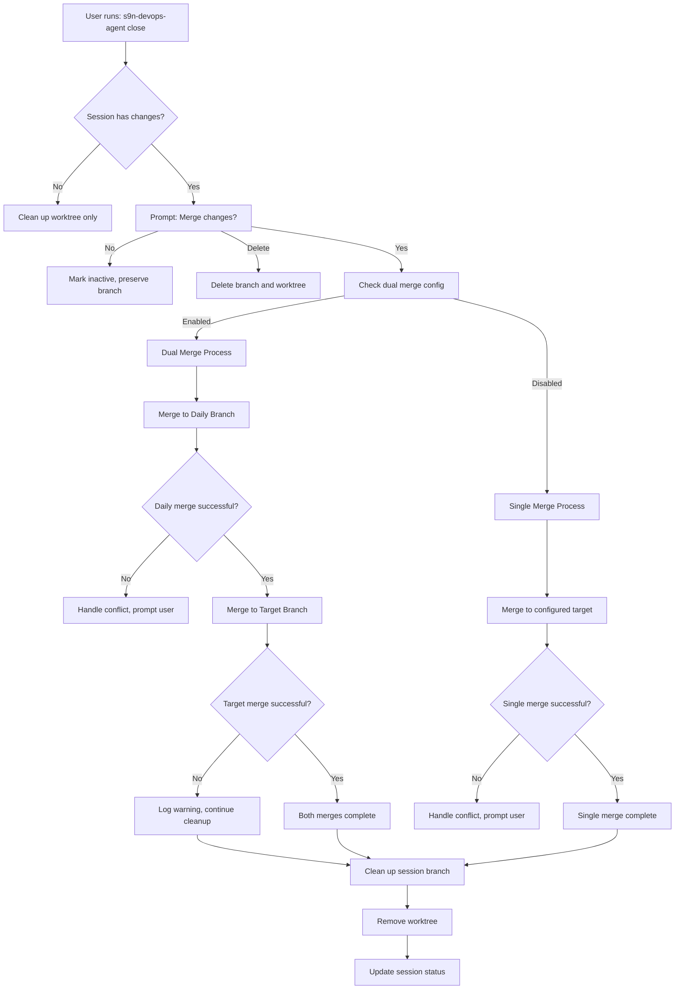
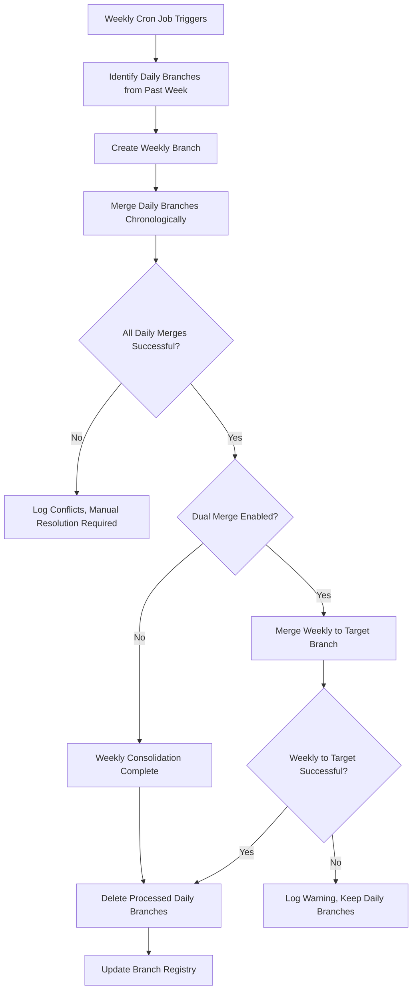
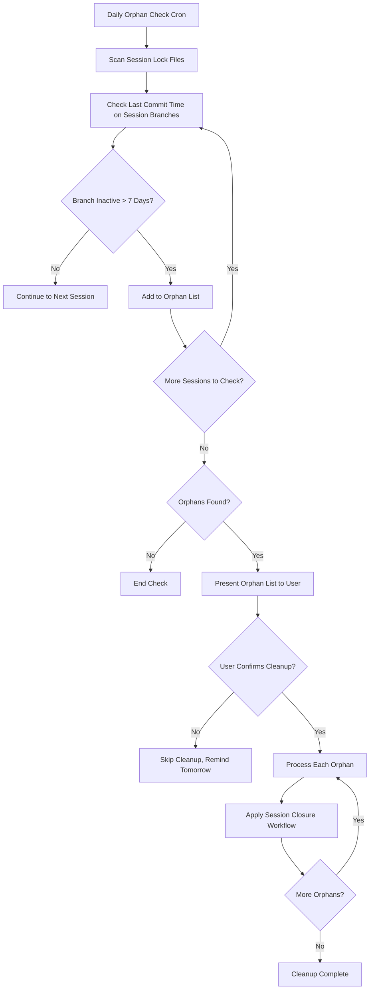

# Enhanced DevOps Agent Branch Management System

**Author:** Manus AI  
**Date:** October 10, 2025

This document presents a comprehensive branch management system for the DevOps Agent that addresses branch proliferation, implements dual merge targets, handles day rollovers for long-running agents, and provides automated cleanup workflows.

## Executive Summary

The current DevOps Agent creates numerous session branches that can quickly become unwieldy. This proposal introduces a hierarchical branching strategy with automated merging, dual-target support, and intelligent cleanup to maintain a clean repository structure while preserving work history.

## 1. Enhanced Branching Architecture

### 1.1 Branch Hierarchy

| Branch Type         | Naming Convention                               | Lifecycle                                                                 | Purpose                                                                                      |
| ------------------- | ----------------------------------------------- | ------------------------------------------------------------------------- | -------------------------------------------------------------------------------------------- |
| **Session Branch**  | `session/<agent-name>/<task-id>`                | Created for a single work session; short-lived (hours to days).           | Isolates work done in a specific session, managed by a single agent for a single task.       |
| **Daily Branch**    | `daily/<YYYY-MM-DD>`                            | Created daily; consolidates work from multiple sessions; short-lived (1 day). | Aggregates all work completed within a single day. Acts as a default merge target.         |
| **Weekly Branch**   | `weekly/<YYYY-MM-DD_to_YYYY-MM-DD>`             | Created weekly; consolidates daily branches; longer-lived (weeks).        | Provides a stable, weekly snapshot of all completed work.                                  |
| **Target Branch**   | User-defined (e.g., `main`, `develop`, `staging`) | Permanent; represents the primary line of development.                    | The ultimate destination for all merged code, configurable by the project owner.             |

### 1.2 Dual Merge Strategy

When a session is closed with cleanup, the system will perform **dual merging** to ensure work is preserved in both the hierarchical structure and the target branch:

1. **Primary Merge**: Session branch → Daily branch (or Weekly if configured)
2. **Secondary Merge**: Session branch → Target branch (if configured)

This creates "two copies" as requested, ensuring work is available in both the structured hierarchy and the main development line.

## 2. Enhanced Configuration System

### 2.1 Project Settings Structure

**File:** `local_deploy/project-settings.json`

```json
{
  "version": "1.4.0",
  "branchManagement": {
    "defaultMergeTarget": "main",
    "enableDualMerge": true,
    "enableWeeklyConsolidation": true,
    "orphanSessionThresholdDays": 7,
    "mergeStrategy": "hierarchical-first",
    "conflictResolution": "prompt"
  },
  "rolloverSettings": {
    "enableAutoRollover": true,
    "rolloverTime": "00:00",
    "timezone": "UTC",
    "preserveRunningAgent": true
  },
  "cleanup": {
    "autoCleanupOrphans": false,
    "weeklyCleanupDay": "sunday",
    "retainWeeklyBranches": 12
  }
}
```

### 2.2 Configuration Options Explained

- **`enableDualMerge`**: When true, session branches merge to both daily/weekly AND target branch
- **`mergeStrategy`**: 
  - `"hierarchical-first"`: Merge to daily/weekly first, then to target
  - `"target-first"`: Merge to target first, then to daily/weekly
  - `"parallel"`: Merge to both simultaneously
- **`preserveRunningAgent`**: Ensures day rollover doesn't disrupt running agents
- **`conflictResolution`**: How to handle merge conflicts (`"prompt"`, `"auto-resolve"`, `"skip"`)

## 3. Detailed Workflow Analysis

### 3.1 Session Closure with Dual Merge



### 3.2 Day Rollover for Long-Running Agents

The current system already handles day rollover well, but we need to enhance it for the new branch structure:

```javascript
// Enhanced rollover logic in cs-devops-agent-worker.js
async function rolloverIfNewDay(repoRoot) {
  if (STATIC_BRANCH) return;

  const today = todayDateStr();
  const todayDaily = dailyNameFor(today);
  
  // Check if we crossed midnight while running
  if (await branchExists(todayDaily) && !FORCE_ROLLOVER) {
    const current = await currentBranch();
    if (current !== todayDaily) {
      log(`Day changed while running - switching to ${todayDaily}`);
      await ensureBranch(todayDaily);
    }
    return;
  }

  // Enhanced rollover with dual merge support
  const projectSettings = await loadProjectSettings();
  const enableDualMerge = projectSettings?.branchManagement?.enableDualMerge || false;
  const targetBranch = projectSettings?.branchManagement?.defaultMergeTarget;

  // Existing rollover logic with enhancements...
  await performEnhancedRollover(today, todayDaily, enableDualMerge, targetBranch);
}
```

### 3.3 Weekly Consolidation Process



### 3.4 Orphaned Session Detection and Cleanup



## 4. Implementation Details

### 4.1 Enhanced Session Coordinator

**File:** `src/session-coordinator.js` (modifications)

```javascript
class SessionCoordinator {
  // ... existing code ...

  async closeSessionWithDualMerge(sessionId, mergeOption) {
    const sessionData = this.getSessionData(sessionId);
    const projectSettings = await this.loadProjectSettings();
    
    if (mergeOption === 'merge') {
      const enableDualMerge = projectSettings?.branchManagement?.enableDualMerge;
      const targetBranch = projectSettings?.branchManagement?.defaultMergeTarget;
      const mergeStrategy = projectSettings?.branchManagement?.mergeStrategy || 'hierarchical-first';
      
      if (enableDualMerge && targetBranch) {
        await this.performDualMerge(sessionData, targetBranch, mergeStrategy);
      } else {
        await this.performSingleMerge(sessionData, targetBranch || this.getDailyBranch());
      }
    }
    
    await this.cleanupSession(sessionData);
  }

  async performDualMerge(sessionData, targetBranch, strategy) {
    const dailyBranch = this.getDailyBranch();
    const sessionBranch = sessionData.branchName;
    
    try {
      if (strategy === 'hierarchical-first') {
        await this.mergeBranch(sessionBranch, dailyBranch);
        await this.mergeBranch(sessionBranch, targetBranch);
      } else if (strategy === 'target-first') {
        await this.mergeBranch(sessionBranch, targetBranch);
        await this.mergeBranch(sessionBranch, dailyBranch);
      } else if (strategy === 'parallel') {
        await Promise.all([
          this.mergeBranch(sessionBranch, dailyBranch),
          this.mergeBranch(sessionBranch, targetBranch)
        ]);
      }
      
      console.log(`✅ Dual merge complete: ${sessionBranch} → ${dailyBranch} & ${targetBranch}`);
    } catch (error) {
      console.error(`❌ Dual merge failed: ${error.message}`);
      throw error;
    }
  }
}
```

### 4.2 Enhanced Close Session Script

**File:** `src/close-session.js` (modifications)

```javascript
class SessionCloser {
  // ... existing code ...

  async promptForCloseAction() {
    const rl = readline.createInterface({
      input: process.stdin,
      output: process.stdout
    });

    return new Promise((resolve) => {
      console.log('\nWhat would you like to do with this session?');
      console.log('  (m) Merge changes and cleanup');
      console.log('  (k) Keep session active, just cleanup worktree');
      console.log('  (d) Delete session and all changes');
      console.log('  (c) Cancel');
      
      rl.question('Choose action (m/k/d/c): ', (answer) => {
        rl.close();
        const action = answer.toLowerCase();
        if (['m', 'k', 'd', 'c'].includes(action)) {
          resolve(action);
        } else {
          console.log('Invalid choice, defaulting to cancel');
          resolve('c');
        }
      });
    });
  }

  async closeSession(sessionData) {
    const action = await this.promptForCloseAction();
    
    switch (action) {
      case 'm':
        await this.mergeAndCleanup(sessionData);
        break;
      case 'k':
        await this.keepSessionCleanupWorktree(sessionData);
        break;
      case 'd':
        await this.deleteSession(sessionData);
        break;
      case 'c':
        console.log('Session close cancelled');
        return;
    }
  }
}
```

### 4.3 Weekly Consolidation Script

**File:** `src/consolidate-branches.js` (new)

```javascript
#!/usr/bin/env node

import fs from 'fs';
import path from 'path';
import { execSync } from 'child_process';

class WeeklyConsolidator {
  constructor() {
    this.repoRoot = this.getRepoRoot();
    this.projectSettings = this.loadProjectSettings();
  }

  async consolidateWeeklyBranches() {
    const lastWeekDailies = await this.getLastWeekDailyBranches();
    if (lastWeekDailies.length === 0) {
      console.log('No daily branches to consolidate');
      return;
    }

    const weeklyBranchName = this.generateWeeklyBranchName(lastWeekDailies);
    console.log(`Creating weekly branch: ${weeklyBranchName}`);

    try {
      // Create weekly branch from first daily
      await this.createBranch(weeklyBranchName, lastWeekDailies[0]);
      
      // Merge remaining dailies
      for (let i = 1; i < lastWeekDailies.length; i++) {
        await this.mergeBranch(lastWeekDailies[i], weeklyBranchName);
      }

      // Dual merge to target if enabled
      if (this.projectSettings?.branchManagement?.enableDualMerge) {
        const targetBranch = this.projectSettings.branchManagement.defaultMergeTarget;
        if (targetBranch) {
          await this.mergeBranch(weeklyBranchName, targetBranch);
        }
      }

      // Cleanup daily branches
      await this.cleanupDailyBranches(lastWeekDailies);
      
      console.log(`✅ Weekly consolidation complete: ${weeklyBranchName}`);
    } catch (error) {
      console.error(`❌ Weekly consolidation failed: ${error.message}`);
      throw error;
    }
  }

  async getLastWeekDailyBranches() {
    // Implementation to find daily branches from the past week
    const branches = execSync('git branch -r', { encoding: 'utf8' })
      .split('\n')
      .filter(branch => branch.includes('daily/'))
      .map(branch => branch.trim().replace('origin/', ''));
    
    // Filter for last week's branches
    const oneWeekAgo = new Date();
    oneWeekAgo.setDate(oneWeekAgo.getDate() - 7);
    
    return branches.filter(branch => {
      const dateStr = branch.replace('daily/', '');
      const branchDate = new Date(dateStr);
      return branchDate >= oneWeekAgo && branchDate < new Date();
    }).sort();
  }
}

// CLI execution
if (import.meta.url === `file://${process.argv[1]}`) {
  const consolidator = new WeeklyConsolidator();
  consolidator.consolidateWeeklyBranches().catch(console.error);
}
```

### 4.4 Orphaned Session Cleanup Script

**File:** `src/cleanup-orphans.js` (new)

```javascript
#!/usr/bin/env node

import fs from 'fs';
import path from 'path';
import { execSync } from 'child_process';
import readline from 'readline';

class OrphanedSessionCleaner {
  constructor() {
    this.repoRoot = this.getRepoRoot();
    this.locksPath = path.join(this.repoRoot, 'local_deploy', 'session-locks');
    this.projectSettings = this.loadProjectSettings();
    this.thresholdDays = this.projectSettings?.branchManagement?.orphanSessionThresholdDays || 7;
  }

  async findOrphanedSessions() {
    if (!fs.existsSync(this.locksPath)) {
      return [];
    }

    const orphans = [];
    const lockFiles = fs.readdirSync(this.locksPath).filter(f => f.endsWith('.lock'));
    const thresholdDate = new Date();
    thresholdDate.setDate(thresholdDate.getDate() - this.thresholdDays);

    for (const lockFile of lockFiles) {
      const lockPath = path.join(this.locksPath, lockFile);
      const sessionData = JSON.parse(fs.readFileSync(lockPath, 'utf8'));
      
      try {
        const lastCommitDate = await this.getLastCommitDate(sessionData.branchName);
        if (lastCommitDate < thresholdDate) {
          orphans.push({
            ...sessionData,
            lastCommitDate,
            daysSinceLastCommit: Math.floor((new Date() - lastCommitDate) / (1000 * 60 * 60 * 24))
          });
        }
      } catch (error) {
        // Branch might not exist, consider it orphaned
        orphans.push({
          ...sessionData,
          lastCommitDate: new Date(sessionData.created),
          daysSinceLastCommit: Math.floor((new Date() - new Date(sessionData.created)) / (1000 * 60 * 60 * 24)),
          branchMissing: true
        });
      }
    }

    return orphans;
  }

  async promptForOrphanCleanup(orphans) {
    console.log(`\n🧹 Found ${orphans.length} orphaned session(s):\n`);
    
    orphans.forEach((orphan, index) => {
      console.log(`${index + 1}. Session: ${orphan.sessionId}`);
      console.log(`   Task: ${orphan.task}`);
      console.log(`   Days inactive: ${orphan.daysSinceLastCommit}`);
      console.log(`   Branch: ${orphan.branchName}${orphan.branchMissing ? ' (missing)' : ''}`);
      console.log('');
    });

    const rl = readline.createInterface({
      input: process.stdin,
      output: process.stdout
    });

    return new Promise((resolve) => {
      rl.question('Would you like to clean up these orphaned sessions? (y/N): ', (answer) => {
        rl.close();
        resolve(answer.toLowerCase() === 'y');
      });
    });
  }

  async cleanupOrphans() {
    const orphans = await this.findOrphanedSessions();
    
    if (orphans.length === 0) {
      console.log('✅ No orphaned sessions found');
      return;
    }

    const shouldCleanup = await this.promptForOrphanCleanup(orphans);
    
    if (!shouldCleanup) {
      console.log('Orphan cleanup cancelled');
      return;
    }

    console.log('\n🧹 Cleaning up orphaned sessions...\n');

    for (const orphan of orphans) {
      try {
        await this.cleanupOrphanedSession(orphan);
        console.log(`✅ Cleaned up session: ${orphan.sessionId}`);
      } catch (error) {
        console.error(`❌ Failed to cleanup session ${orphan.sessionId}: ${error.message}`);
      }
    }

    console.log('\n✅ Orphan cleanup complete');
  }

  async cleanupOrphanedSession(orphan) {
    // Apply the same dual merge logic as regular session closure
    if (!orphan.branchMissing) {
      const enableDualMerge = this.projectSettings?.branchManagement?.enableDualMerge;
      const targetBranch = this.projectSettings?.branchManagement?.defaultMergeTarget;
      
      if (enableDualMerge && targetBranch) {
        await this.performDualMerge(orphan, targetBranch);
      } else {
        await this.performSingleMerge(orphan, targetBranch || this.getDailyBranch());
      }
    }

    // Cleanup session files and worktree
    await this.cleanupSessionFiles(orphan);
  }
}

// CLI execution
if (import.meta.url === `file://${process.argv[1]}`) {
  const cleaner = new OrphanedSessionCleaner();
  cleaner.cleanupOrphans().catch(console.error);
}
```

## 5. Command Line Interface Enhancements

### 5.1 New Commands

```bash
# Enhanced session management
s9n-devops-agent close --session <id> --action merge|keep|delete
s9n-devops-agent close --all-orphans

# Branch management
s9n-devops-agent branches list
s9n-devops-agent branches consolidate --weekly
s9n-devops-agent branches cleanup --orphans

# Configuration
s9n-devops-agent config set branchManagement.enableDualMerge true
s9n-devops-agent config get branchManagement
```

### 5.2 Enhanced Setup Wizard

The setup wizard will be updated to include the new branch management options:

```javascript
// In setup-cs-devops-agent.js
async function setupBranchManagement() {
  console.log('\n🌿 Branch Management Configuration\n');
  
  const defaultTarget = await prompt('Default merge target branch (main): ') || 'main';
  const enableDualMerge = await promptYesNo('Enable dual merge (to both daily and target)? (Y/n): ');
  const orphanThreshold = await prompt('Days before session considered orphaned (7): ') || '7';
  
  return {
    defaultMergeTarget: defaultTarget,
    enableDualMerge: enableDualMerge,
    orphanSessionThresholdDays: parseInt(orphanThreshold),
    enableWeeklyConsolidation: true,
    mergeStrategy: 'hierarchical-first'
  };
}
```

## 6. Testing Strategy

### 6.1 Unit Tests

- Test dual merge logic with various conflict scenarios
- Test day rollover with long-running agents
- Test orphaned session detection accuracy
- Test weekly consolidation with multiple daily branches

### 6.2 Integration Tests

- Test complete session lifecycle with dual merge
- Test agent restart after day rollover
- Test conflict resolution workflows
- Test configuration changes during active sessions

### 6.3 End-to-End Tests

- Multi-day agent runs with rollover
- Multiple parallel sessions with cleanup
- Weekly consolidation with real branch history
- Orphan cleanup with various session states

## 7. Migration Strategy

### 7.1 Backward Compatibility

The enhanced system will maintain backward compatibility with existing installations:

- Existing sessions continue to work without changes
- New features are opt-in through configuration
- Legacy branch naming is supported alongside new conventions

### 7.2 Migration Steps

1. **Update Configuration**: Add new `branchManagement` section to project settings
2. **Gradual Rollout**: Enable features one at a time to test stability
3. **Data Migration**: Convert existing session branches to new naming convention
4. **Documentation Update**: Update all documentation and examples

## 8. Monitoring and Observability

### 8.1 Logging Enhancements

- Log all merge operations with success/failure status
- Track branch creation and deletion events
- Monitor orphaned session detection and cleanup
- Log day rollover events and timing

### 8.2 Metrics Collection

- Number of active sessions over time
- Branch creation and cleanup rates
- Merge conflict frequency and resolution time
- Agent uptime and rollover success rates

## 9. Future Enhancements

### 9.1 Web Dashboard

A web-based dashboard could provide:
- Real-time session monitoring
- Branch visualization and history
- Conflict resolution interface
- Configuration management UI

### 9.2 Remote Coordination

For teams working across multiple machines:
- Centralized session registry
- Remote conflict detection
- Distributed lock management
- Team activity coordination

### 9.3 AI-Assisted Conflict Resolution

- Automatic merge conflict analysis
- Suggested resolution strategies
- Learning from past conflict resolutions
- Integration with AI coding assistants

## Conclusion

This enhanced branch management system addresses all the key requirements while providing a robust, scalable foundation for future development. The dual merge strategy ensures work is preserved in both hierarchical and target branches, while automated cleanup prevents repository bloat. The system handles day rollovers gracefully for long-running agents and provides comprehensive orphaned session management.

The implementation maintains backward compatibility while introducing powerful new features that can be adopted gradually. With proper testing and monitoring, this system will significantly improve the DevOps Agent's usability and maintainability.

## References

[1] Current DevOps Agent Implementation - https://github.com/SecondBrainAICo/CS_DevOpsAgent  
[2] Git Worktree Documentation - https://git-scm.com/docs/git-worktree  
[3] Git Branching Strategies - https://nvie.com/posts/a-successful-git-branching-model/  
[4] Automated Git Workflows - https://docs.github.com/en/actions/using-workflows
